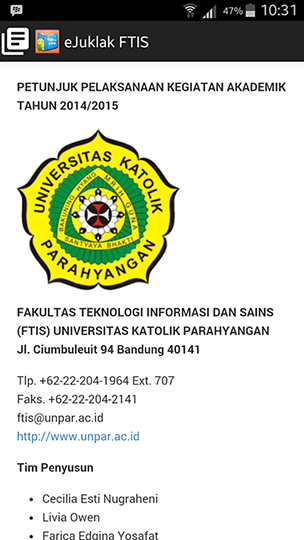
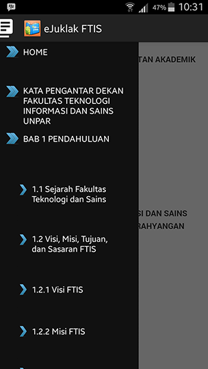
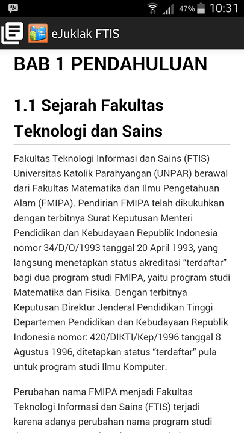
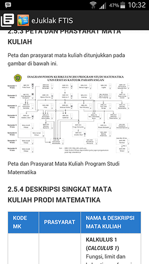
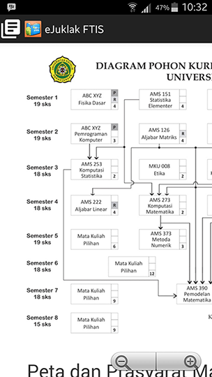

# Penjelasan cara menggunakan aplikasi: 

Petunjuk pelaksaan (Juklak) elektronik (disingkat Juklak-e atau e-juklak) atau juklak digital  adalah versi elektronik dari buku petunjuk pelaksanaan  yang berisikan informasi digital berupa gambar atau teks sama seperti  juklak dalam bentuk lembaran kertas. Aplikasi ini dibuat dengan dasar pemrograman Java untuk sistem operasi Android.

1. Klik logo aplikasi
2. Setelah logo aplikasi diklik, maka konten dari juklak akan segera tampil.  
  
3. Anda bisa menscroll konten juklak mulai dari konten paling awal hingga konten paling akhir
4. Selain menscroll konten juklak secara langsung, Anda juga dapat memanfaatkan menu daftar isi yang disediakan pada aplikasi. Dengan mengklik icon menu di sudut kiri atas aplikasi, kita dapat mengakses konten juklak sesuai dengan bab yang kita inginkan.  
  
5. Misalkan kita ingin membaca isi dari bab 1 tanpa harus menscroll terlebih dahulu dari tampilan awal, maka kita tinggal mengtouch bab 1 pada bagian menu daftar isi.  
  
6. Selain daftar bab, pada menu daftar isi juga tersedia daftar sub bab. Sehingga kita juga dapat langsung mengklik bagian sub bab pada daftar isi jika kita ingin langsung membaca juklak pada bagian sub bab tertentu.
7. Kita dapat melakukan zoom-in dan juga zoom-out pada konten ejuklak. Sehingga jika terdapat gambar yang tidak terlihat jelas pada ukuran layar normal, maka kita dapat melakukan zoom-in sehingga gambarnya dapat kita lihat secara jelas. Semua konten pada ejuklak dapat kita zoom-in dan zoom-out. Sehingga tidak perlu khawatir jika konten ejuklak tidak dapat dengan jelas dibaca.  
  - **Gambar Standar**  
    
  - **Setelah Zoom**  
    
8. Aplikasi ejuklak ini pun dapat mengikuti posisi layar ketika Anda me-rotate handphone Anda. Sehingga Anda dapat membaca ejuklak baik dalam posisi handphone sedang vertical maupun horizontal. 
