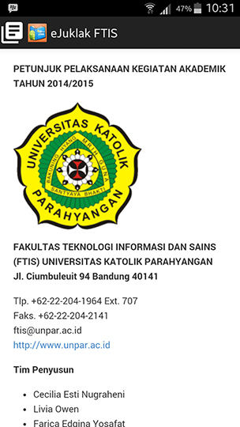
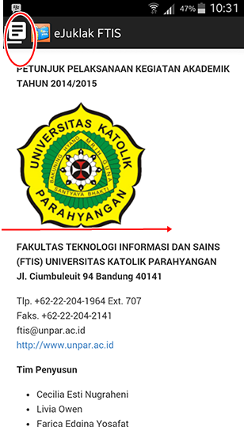
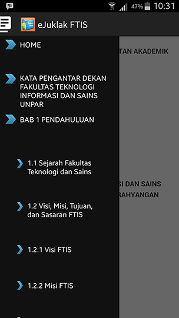
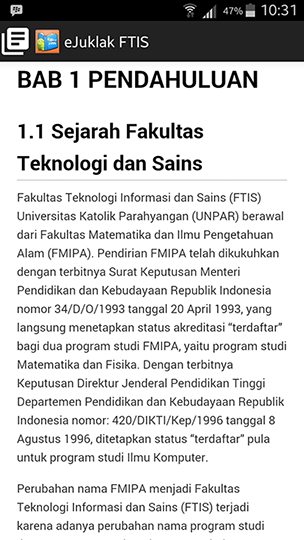
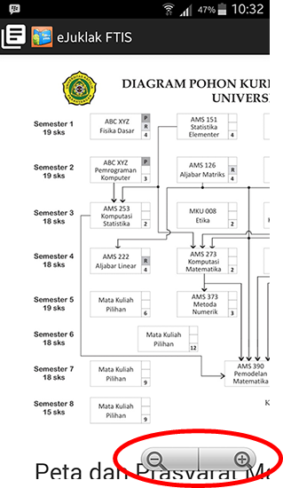

# Penjelasan Cara Menggunakan Aplikasi

Petunjuk pelaksaan (juklak) elektronik atau juklak digital adalah versi elektronik dari buku petunjuk pelaksanaan  yang berisikan informasi digital berupa gambar atau teks sama seperti  juklak dalam bentuk lembaran kertas. Aplikasi ini dibuat dengan dasar pemrograman Java untuk sistem operasi Android.

1. Tekan logo aplikasi
2. Setelah logo aplikasi diklik, maka konten dari juklak akan segera tampil.  
  
3. Anda bisa melakukan *scroll* konten juklak mulai dari konten paling awal hingga konten paling akhir
4. Selain melakukan *scroll* konten juklak secara langsung, aplikasi ini menyediakan fitur menu daftar isi, yang bisa Anda akses dengan menekan *icon* menu daftar Isi di sudut kiri atas aplikasi atau menggeser layar ujung kiri ke kanan, Anda dapat mengakses konten juklak sesuai dengan bab yang Anda inginkan.  
  
  
5. Misalkan Anda ingin membaca isi dari Bab 1 tanpa harus melakukan *scroll* terlebih dahulu dari tampilan awal, maka Anda dapat langsung menekan menu bab 1 pada bagian menu daftar isi.  
  
6. Selain daftar bab, pada menu daftar isi juga tersedia daftar subbab. Anda dapat langsung menekan bagian subbab pada daftar isi jika Anda ingin membaca juklak pada bagian subbab tertentu.
7. Anda dapat melakukan *zoom-in* dan  *zoom-out* pada konten e-Juklak. Jika  gambar atau tulisan tidak terlihat jelas pada ukuran layar normal,  Anda dapat melakukan *zoom-in* sehingga gambar atau tulisan yang dimaksud dapat Anda lihat secara jelas. Semua konten pada e-Juklak dapat Anda *zoom-in* dan *zoom-out*. Sehingga tidak perlu khawatir jika konten e-Juklak tidak dapat dengan jelas dibaca.  
  - **Gambar Standar**  
    
  - **Setelah Zoom**  
    
8. Aplikasi e-Juklak ini dapat mengikuti posisi layar ketika Anda melakukan *rotate handphone* Anda. Sehingga Anda dapat membaca e-Juklak baik dalam posisi *handphone* sedang vertical maupun horizontal. 
